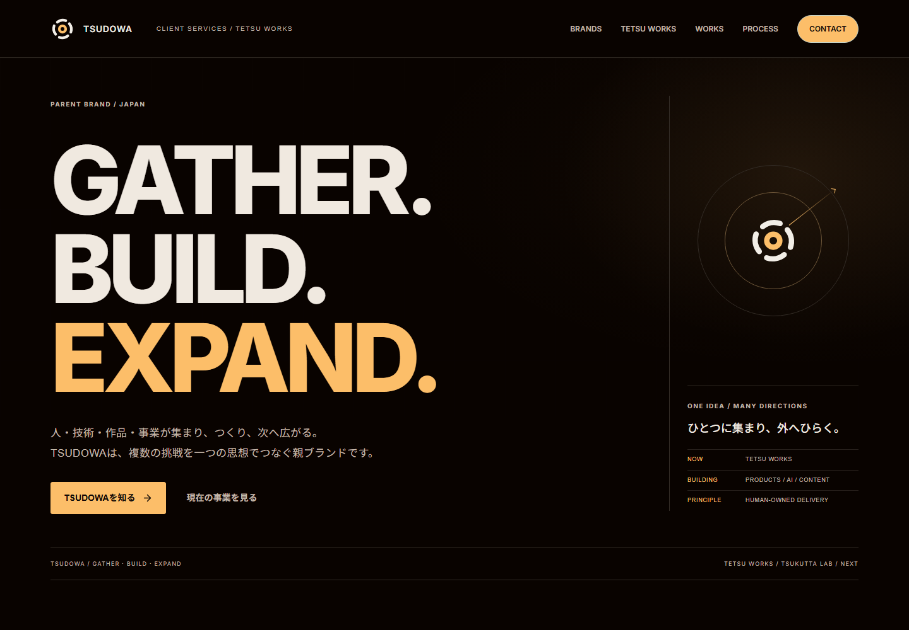

# TETSU / WORKS — Figma Sales UI

公開サイト: https://tetsu-works.netlify.app （2026-09-11 HTTP 200を確認）。今回の再設計は `codex/portfolio-figma-sales-ui`。main・Netlify設定・本番環境変数は変更せず、公開反映前のブランチとして提供します。

[ページ別ビジュアル・素材一覧](docs/VISUAL_ASSETS.md) / [ビジュアル更新QA](docs/VISUAL_RELEASE_QA.md)

[デザインとFigma対応表](docs/FIGMA_SALES_UI.md) / [最新QA](docs/RELEASE_QA.md) / [公開手順](docs/PRODUCTION.md)

トップは代表4作品。全11作品は `/works`、既存12カテゴリ・全デモURLを維持。KISSA / FLOWSTATE / FORME / SMART INBOXの詳細に、実画面・価格・納期・納品物とメッセージ進行を整理しています。

AIを活用して制作を効率化しながら、人が使える完成品まで責任を持って仕上げる。その姿勢を、設計・制作・実装・テスト・納品の具体例で伝える営業用Webアプリです。クラウドワークス・ランサーズ等の応募では、依頼内容に合うカテゴリURLを1本案内できます。

**全作品は SELF-INITIATED DEMO / 自主制作。** 架空企業・商品・顧客データは実案件や成果実績ではありません。相談文をコピーして案件サイト内で進められます。直接相談用のメールフォームは本番設定済みの場合に表示します。



## 案件別URL

| 依頼内容                | URL                  |
| ----------------------- | -------------------- |
| Webサイト制作           | `/works/web`         |
| LP制作                  | `/works/lp`          |
| HTML / CSS / JavaScript | `/works/coding`      |
| TypeScript / Next.js    | `/works/nextjs`      |
| レスポンシブ            | `/works/responsive`  |
| 既存サイト修正・改善    | `/works/improvement` |
| EC・商品ページ          | `/works/ec`          |
| Webアプリ・管理画面     | `/works/apps`        |
| API・外部連携           | `/works/api`         |
| AI・業務自動化          | `/works/automation`  |
| デザイン・コンテンツ    | `/works/design`      |
| テスト・QA・納品        | `/works/qa`          |

## 作品と実装範囲

詳細は `/projects/{slug}`、操作は `/demos/{slug}`。11作品のうち主要8作品を営業画像セットの対象としています。

| slug        | 作品                         | 実際に操作できる内容                     |
| ----------- | ---------------------------- | ---------------------------------------- |
| cafe        | KISSA / カフェ公式サイト     | Coffee・Foodメニュー切替、セクションナビ |
| saas        | FLOWSTATE / SaaS LP          | 月・年額比較、FAQ開閉                    |
| ec          | FORME / 商品LP               | 色・数量・小計、カート確認・削除         |
| automation  | RELAY / AI問い合わせ導入想定 | ローカル分類、下書き編集、確認・差戻し   |
| booking     | DAYBOOK / 予約管理           | 日付・検索・追加・枠競合検証・取消確認   |
| improvement | REFINE / 改善比較            | 同じ情報のBefore / After切替             |
| creative    | STILL / 広告制作             | 3方向性・3比率、SVGダウンロード          |
| qa          | SHIP / CHECK / 納品工程      | チェック・進捗・デモマニフェスト出力     |
| csv         | CSV AUTOMATOR（既存）        | 入出力・整形・重複除去・検索・集計       |
| inbox       | SMART INBOX（既存）          | 分類・担当・状況・返信案編集・コピー     |
| admin       | ADMIN DASHBOARD（既存）      | 顧客CRUD・保存・検索・履歴               |

各作品デモにはAI API・メール送信・決済・実予約はありません。サイトの問い合わせフォームは別途サーバー送信に対応します。RELAYはAI連携を検討するための**固定ルール・定型文によるシミュレーション**です。FLOWSTATEのプロダクト画面はLP内のデザインプレビューです。QAのチェックは手動操作デモであり、自動テストの実行・成功を意味しません。

## 技術構成

Next.js 16 App Router / React 19 / TypeScript / Tailwind CSS 4 + CSS / Lucide / Vitest / Playwright / axe-core。依存バージョンの実体はpackage-lock.jsonに固定。任意のブラウザ監視にSentry公式SDKを使用します。Interはローカル配信。有料素材・3Dライブラリは不要です。

基本はServer Components。フィルタ・相談欄・デモ操作・任意計測だけをClient Componentsにしています。CSS/SVGのオリジナル素材と、Playwrightで撮影したWebPを使用します。

## ローカル起動・検証

Node.js 24推奨。Windows PowerShellでは`npm.cmd` / `npx.cmd`も使用できます。

```bash
npm ci
npm run dev
# http://localhost:3000
npm run lint
npm run typecheck
npm test
npm run build
npm start
```

```bash
npx playwright install chromium
npm run verify            # lint + typecheck + Vitest + production build
npm run test:e2e          # 自動サーバー起動: port 3100
npm run screenshots      # 自動サーバー起動: port 3101
npm run qa:design        # Figma対応6画面・4幅のaxe/focusと実画像
npm run qa:visual        # 自動サーバー起動: port 3102
npm run qa:links         # 全内部リンク・アンカーの読み取り検査
npm run qa:performance   # Lighthouseのモバイル実測: port 3104
npm run format:check
npm run verify:all       # verify + format + E2E + screenshots + Visual QA
```

外部サービスの環境変数なしで動作します。画像がまだない新規作品を追加した場合は、build → screenshots → buildの順で画像を生成・取り込みしてください。既存のプレビュー画像はGit管理しています。

E2EはChromiumのDesktop 1440×1000 / Tablet 768×1024 / Mobile 390×664で実行。Visual QAは320 / 390 / 768 / 1440pxで全37コンテンツルートを確認します。実機Safari/Androidの検証とは区別してください。

## スクリーンショット

`npm run screenshots`で主要8作品×5枚＝40枚を`docs/screenshots/portfolio/`に生成します。

- `{slug}-desktop-firstview.png`
- `{slug}-desktop-full.png`
- `{slug}-mobile-firstview.png`
- `{slug}-desktop-feature.png`
- `{slug}-desktop-case-study.png`

加えて11作品×3サイズ＝33枚を`public/previews/*.webp`へ生成し、作品詳細のデバイスプレビューに使用。`manifest.json`に生成枚数を記録、`contact-sheet.png`は画面レビュー用の一覧です。スクリーンショットのモバイルサイズは390×844です。`QA_BASE_URL`指定時は既存サーバーを使用し、自動サーバーを起動しません。

## データ駆動の追加方法

1. `src/lib/portfolio.ts`の`projects`に`Project`型の情報を追加します。slugは一意な英数字・ハイフンにします。
2. カテゴリID、想定依頼、課題、解決、コンセプト、機能、技術、料金・期間、納品物、QA、制約を記入。実案件でない作品は必ず自主制作として扱います。
3. 操作デモは`src/components/showcase-demos.tsx`に追加し、`src/app/demos/[slug]/page.tsx`のデモ対応表に登録。既存デモの静的ルート方式も利用可能です。
4. `src/components/project-art.tsx`とCSSでカード用アートを設定。新規カタログだけでカテゴリ表示・詳細・metadata・sitemapへ反映されます。
5. build、screenshots、verify:allを実行します。

新規カテゴリは同ファイルの`categories`にID・営業説明・参考料金・期間・素材・技術を追加し、最低1作品にタグ付けします。`CategoryId`は自動で更新され、ルートと営業セクションは共通テンプレートから生成されます。12カテゴリ固定のテストは仕様変更時に更新してください。

## 本番公開と外部サービス

最新の設定手順は [PRODUCTION.md](docs/PRODUCTION.md)、価格比較は [EXTERNAL_SERVICES.md](docs/EXTERNAL_SERVICES.md)。Netlify Freeを選択し、`netlify.toml` と公開用環境変数検査を追加しています。Node.js 24 / `npm ci` / `npm run build:production`。独自ドメインは後から接続可能です。

`.env.example`を参照し、秘密値は公開先のサーバー環境変数に設定。NEXT_PUBLIC_SITE_URLを正規HTTPSオリジンにし、metadata / canonical / OGP / sitemap / robotsへ反映します。セキュリティヘッダー、404、React/global error境界を実装。

問い合わせは既存の相談文コピーに加え、設定済みの場合だけ直接メール送信を表示。Resend / Turnstile / 共有Redis上限をサーバーで検証します。未設定時は準備中、障害時は失敗と表示して入力を保持します。メールアドレス・本文は通知以外の分析/障害監視へ送信しません。

PostHogは訪問→カテゴリ→作品→料金→相談開始→送信→成功の匿名30分ファネルを計測。utm_sourceはcrowdworks / lancers / direct / otherに限定。既存5イベントを維持し、DNT/GPCでは無効です。Sentryはブラウザ・React境界・Nextサーバー・問い合わせ/分析API障害を検知。両者とも設定時だけ動作し、実アカウントでの受信確認は接続後に必要です。

実AI APIは追加していません。既存の自主制作デモ・料金・納品物・品質確認を営業の中心にします。ログイン・決済・管理画面追加も不要です。

## 品質・安全性

- 全デモの入力はローカル処理。相談文コピーでは外部送信なし。直接フォームは明示的な同意と送信操作時のみ通知。
- CSV: UTF-8 / 2MB / 10,000行 / 50列、引用符検証、BOM付き出力、Excel数式対策。`.xlsx`・Shift_JISは非対応。集計は全データ、出力は加工後全件。
- inbox / automation: キーワード分類・固定返信、人による確認。再読み込みで初期化、メール送信なし。
- admin: 最大1,000顧客、売上は0〜999,999,999円の整数。localStorage破損時・保存不可時の通知。複数端末同期・認証・共有DB・バックアップ・監査証跡は非対応。
- booking / ec: 画面内状態のみ、実予約・決済なし。
- キーボード・focus-visible・semantic HTML・native dialog・フォームラベル・reduced motion。
- 色・間隔・半径のトークンは`hub.css`、作品別CSSは`showcase.css`。Figmaレビュー手順は[DESIGN_SYSTEM.md](docs/DESIGN_SYSTEM.md)。

最新の実測結果・制限は[今回のQA記録](docs/RELEASE_QA.md)。前回の詳細は[QA記録](docs/QA.md)。企画の根拠は[仕様書](docs/PORTFLOWSTATE_SALES_HUB_V2.md)と[Issue #1](https://github.com/rapper-droid/freelance-portfolio/issues/1)、調査・設計は[IMPLEMENTATION_V2.md](docs/IMPLEMENTATION_V2.md)。
