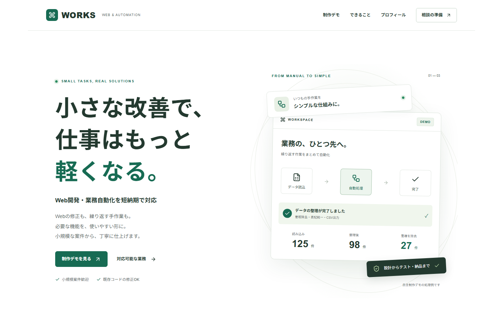
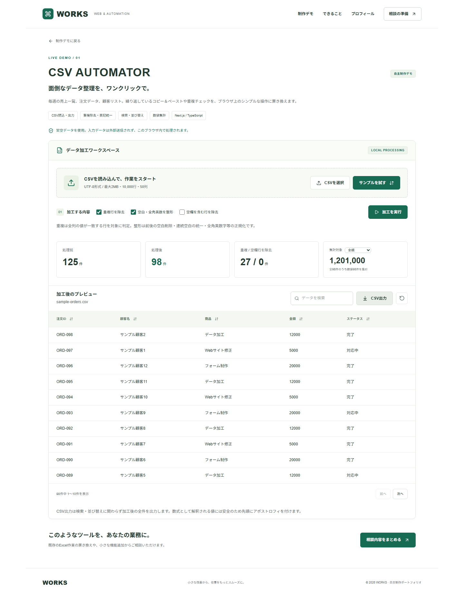
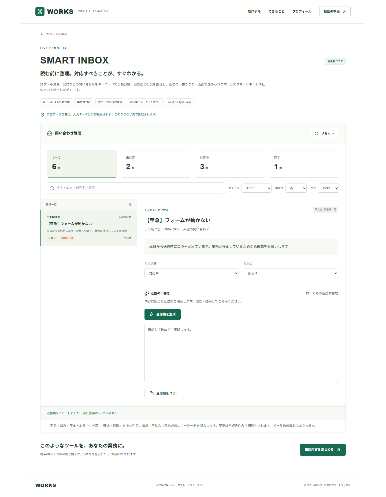
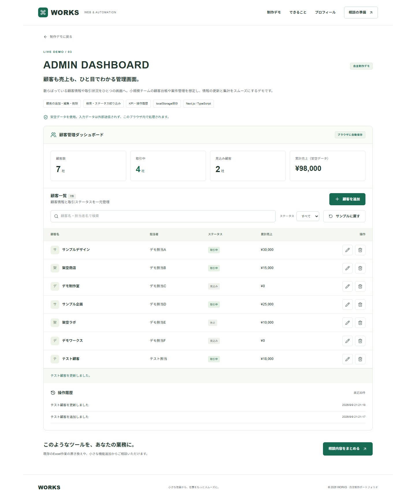

# WORKS — Web開発・業務自動化ポートフォリオ

小さな改善で、仕事はもっと軽くなる。

小規模なWeb開発・業務自動化を依頼したい方に向けた、**実際に操作できる自主制作ポートフォリオ**です。ランサーズ・クラウドワークス等で5,000〜30,000円程度の案件をご相談いただくことを想定し、できること・進め方・成果物を短時間で把握できる構成にしています。

架空の顧客実績・売上実績・企業導入実績は掲載していません。画面内の顧客・問い合わせ・売上はすべてデモ用の架空データです。

## スクリーンショット

Playwrightで実際の画面を撮影しています。全体画像は `npm run test:e2e` で更新できます。ファーストビュー等はローカルサーバーの起動後に `node scripts/visual-qa.mjs` で更新します。



[トップページ全体](docs/screenshots/home-desktop.png) / [スマホのファーストビュー](docs/screenshots/home-mobile-firstview.png) / [スマホの相談フォーム](docs/screenshots/contact-mobile.png)

| CSVデータ加工                                | 問い合わせ管理                                        | 顧客管理                                            |
| -------------------------------------------- | ----------------------------------------------------- | --------------------------------------------------- |
|  |  |  |

スマートフォン版：[トップ](docs/screenshots/home-mobile.png) / [CSV](docs/screenshots/csv-mobile.png) / [問い合わせ](docs/screenshots/inbox-mobile.png) / [管理画面](docs/screenshots/admin-mobile.png)

## 制作デモ

### 1. CSV AUTOMATOR — `/demos/csv`

注文一覧や顧客リストなど、Excelで繰り返している整理作業をブラウザ上の操作に置き換えます。

- CSVファイルの読み込み、サンプルのワンクリック投入
- 任意の列構成に対応した表形式プレビュー、検索、並び替え、ページ送り
- 全列が一致する重複行の除去、空欄を含む行の任意除去
- 前後の空白除去、連続空白統一、NFKCによる全角英数字等の正規化
- 処理前・処理後・除去件数、指定列の数値合計
- BOM付きUTF-8 CSVダウンロード（Excelでの数式解釈を抑止）

**お試し手順：**「サンプルを試す」→「加工を実行」→125件が98件に、重複27件を除去→「CSV出力」。サンプル加工後の金額合計は1,201,000です。架空の注文データの集計値であり、実際の売上ではありません。

制約：UTF-8、2MB、10,000データ行、50列まで。ヘッダーは必須・空欄や重複不可。引用符・改行を含むCSVに対応し、不正な列数や引用符はエラー表示します。完全な空行は読込時に除外します。集計は検索条件によらず全データを対象とし、空欄と非数値を除外します。CSV出力は加工後の全件を元の並びで出力します。Excelの `.xlsx` やShift_JISは対象外です。

### 2. SMART INBOX — `/demos/inbox`

問い合わせの確認・優先度整理・担当管理・返信下書きを一画面で進めるデモです。

- 架空の問い合わせ6件、一覧と詳細
- キーワードに基づくカテゴリ・緊急度判定
- 全文検索、カテゴリ・緊急度・担当・対応状況でのフィルタ
- 未対応／対応中／完了と担当者の変更
- カテゴリに応じた返信案生成、編集、コピー

**お試し手順：** 緊急度「高」を選択→フォーム不具合の詳細を開く→担当・状況を変更→返信案を生成・編集。

AI APIは使用していません。キーワードと固定テンプレートによるローカル処理であり、分類精度や返信内容は人による確認が必要です。変更は再読み込みで初期化されます。メールの受信・送信・外部サービス連携はありません。

### 3. ADMIN DASHBOARD — `/demos/admin`

小規模チームの顧客台帳・取引状況の管理を想定した管理画面です。

- 顧客一覧、顧客名・担当者名検索、ステータス絞り込み
- 顧客の追加・編集・削除、入力検証、削除前の確認
- 顧客数、取引中、見込み顧客、架空の累計売上KPI
- 直近30件の追加・更新・削除履歴
- localStorageで再読み込み後も保持、サンプルへのリセット
- 保存データの形式検証、破損時・保存失敗時の説明

**お試し手順：**「顧客を追加」→架空の名前と金額を入力→編集でステータス変更→再読み込みで維持を確認→削除。Escでダイアログを閉じられます。

制約：最大1,000顧客、売上は0〜999,999,999円の整数。ブラウザ単位の保存で、複数端末・複数タブの同期、ログイン、DB、バックアップ、監査証跡としての履歴は備えていません。同じブラウザを共有する場合は保存内容が共有されます。実際の顧客情報は入力しないでください。

## 営業・相談導線

トップページに対応可能な業務、技術と用途の対応、相談→要件整理→実装→確認→修正→納品の流れ、開発スタンスを掲載しています。

相談フォームは**外部送信を行わず**、入力内容をコピーします。このページを案内した案件サイトのメッセージへ貼り付けて利用する想定です。コピーが使えない環境では手動コピー用テキストを表示します。架空の連絡先・個人名・SNSリンクは作成していません。費用・納期は内容を確認したうえで相談し、即日納品等を保証する表現は使用していません。

Python・GAS・スプレッドシート・外部API連携等は相談対象として明記し、**本リポジトリで実装・検証済みの機能とは区別**しています。

## 使用技術

| 技術                                    | 用途                                         |
| --------------------------------------- | -------------------------------------------- |
| Next.js 16.3.4 / App Router             | ページ構成、静的事前生成、メタデータ、404    |
| React 19 / TypeScript                   | 操作画面、型定義、CSV・分類ロジック          |
| Tailwind CSS 4 / CSS                    | レスポンシブ設計、デザイントークン、画面装飾 |
| Lucide React                            | 軽量なSVGアイコン                            |
| localStorage / File API / Clipboard API | ブラウザ内保存、CSV入出力、相談内容コピー    |
| ESLint / Prettier                       | 静的解析、整形                               |
| Vitest / Playwright / axe-core          | 単体・E2E・アクセシビリティ検査              |

主要デモの実行にDB・APIキー・有料API・外部フォントは不要です。Next.jsは構築時点のnpm公開最新安定版を固定し、依存関係は `package-lock.json` で管理しています。[Next.js公式の導入ガイド](https://nextjs.org/docs/app/getting-started/installation)に沿ったApp Router構成です。

## セットアップ

Node.js 24とnpmを推奨します。Node.js 22.12以上の22.xでも利用できます。Next.js単体の最低要件よりも、Vitestを含む開発ツールの要件に合わせています。

```bash
npm ci
npm run dev
```

http://localhost:3000 を開きます。Windows PowerShellで実行ポリシーによる制限がある場合は `npm.cmd` / `npx.cmd` を使用してください。

## 開発・テストコマンド

```bash
npm run dev           # 開発サーバー
npm run lint          # ESLint
npm run typecheck     # TypeScript
npm run test          # Vitest
npm run build         # 本番ビルド
npm run start         # ビルド済みアプリの起動
npm run format        # Prettierで整形
npm run format:check  # 整形チェック
npm run verify        # lint → typecheck → unit test → build

npx playwright install chromium
npm run build
npm run test:e2e      # 本番サーバーを3100番で自動起動してテスト
npx playwright show-report
```

E2Eは1440×1000のデスクトップと390×664のiPhone 13相当設定でChromiumを使用します（モバイルは画面・タッチ操作のエミュレーションであり、実機Safari検証ではありません）。スクリーンショットは `docs/screenshots/`、失敗時のトレース等は `test-results/` に生成します。

CSVの実ファイル入力・出力、問い合わせの絞り込み・返信編集、顧客CRUD・保存・破損データ・ダイアログ操作、トップページ導線とコピー、404、主要画面のaxe検査を含みます。詳しくは [QA記録](docs/QA.md) を参照してください。

## ディレクトリ構成

```text
src/
  app/
    page.tsx             # 営業用トップページ
    layout.tsx           # 共通メタデータ・日本語設定
    globals.css          # 全体・各デモ・モバイルのスタイル
    demos/{csv,inbox,admin}/page.tsx
    error.tsx / not-found.tsx
  components/
    site.tsx             # ヘッダー、フッター、デモ共通構成
    contact.tsx          # 相談文の作成・コピー
    *-demo.tsx           # 各デモの操作UI
  lib/
    csv.ts               # CSV解析・整形・安全な出力
    inbox.ts             # キーワード分類・返信テンプレート
    admin.ts             # 顧客型・初期値・保存データ検証
public/                  # OGP画像など
tests/{unit,e2e}/         # 単体・ブラウザテスト
docs/screenshots/        # PC・スマホの実画面
```

## デプロイ（Vercel）

1. このフォルダを自身のGitHubリポジトリへ登録します。
2. Vercelからそのリポジトリをインポートし、Framework PresetをNext.jsに設定します。
3. ビルドコマンドは `npm run build`。ルートディレクトリはこのプロジェクトのルートです。
4. `NEXT_PUBLIC_SITE_URL` に公開するHTTPSオリジン（例：`https://your-project.vercel.app`）を設定してデプロイします。設定値は公開URLであり秘密情報ではありません。
5. 公開ページのOGP・3つのデモ・相談内容コピーを確認します。URLを変更した場合は環境変数を更新して再ビルドします。

本リポジトリの作成時点では外部公開していません。公開先アカウントやドメインは必要に応じて利用者が設定します。自前のNode.jsサーバーでは `npm run build` → `npm run start` で稼働します。公開環境ではClipboard APIのためにHTTPSを利用してください。

## 品質と運用上の範囲

- 日本語のtitle / description、OGP PNG、アイコン、semantic HTML、スキップリンク
- キーボード操作、フォーカス表示、ネイティブdialog、状態通知・エラー通知
- モバイルレイアウト、表の横スクロール、動きを減らす設定への対応
- 入力値はテキストとして表示し、HTMLとして挿入しません
- CSVはメモリ内、問い合わせは画面内、顧客台帳のみlocalStorageに保存
- OGPの絶対URLとサイトマップは公開URL設定に依存します
- 認証、実顧客向けセキュリティ、共有DB、外部送信、外部API連携は本デモの対象外

実運用に転用する場合は、保存先・権限・対象データ・バックアップ等を業務要件に合わせて設計してください。
